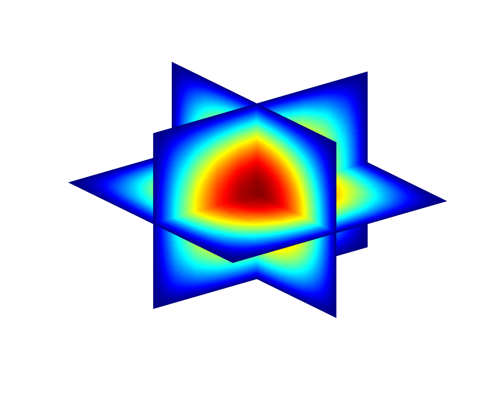

# PETSc_MsFEM

**Introduction:**

This project implements the Multiscale Finite Element Method (MsFEM) using the PETSc library. MsFEM is a numerical method for solving problems with multiscale features, such as flow and transport in heterogeneous materials.




**Key Features:**

*   High-performance computing using the PETSc library.
*   Implementation of the basic MsFEM algorithm.
*   Includes an example 3D head model dataset.

**File Descriptions:**

*   `main2.cpp`: Main program entry point. Sets up the problem, calls the MsFEM solver, and outputs the results.
*   `msfem.cpp`: Contains the specific implementation of the MsFEM algorithm, such as constructing basis functions, assembling the stiffness matrix, and solving the linear system.
*   `head3d.h`: Defines the mesh data for the 3D head model.

**Dependencies:**

*   PETSc (Portable, Extensible Toolkit for Scientific Computation): A library for high-performance scientific computation. Please ensure you have installed and properly configured PETSc.
*   CMake: Cross-platform build system generator.

**Building and Running:**

1.  **Install PETSc:** Refer to the PETSc official website ([https://petsc.org/](https://petsc.org/)) for installation instructions.  Make sure the `PETSC_DIR` and `PETSC_ARCH` environment variables are set correctly. Here's a streamlined example:

    *   **Downloading PETSc:**
        *   Go to the PETSc download page: [https://petsc.org/release/download/](https://petsc.org/release/download/)
        *   Download the latest stable release (e.g., `petsc-3.20.2.tar.gz`).

    *   **Extracting PETSc:**
        *   Open a terminal and navigate to the directory where you downloaded the PETSc archive.
        *   Extract the archive:

            ```bash
            tar -xzf petsc-3.20.2.tar.gz
            ```

            This will create a directory named `petsc-3.20.2`.

    *   **Configuring PETSc:**
        *   Change directory to the PETSc source directory:

            ```bash
            cd petsc-3.20.2
            export PETSC_DIR=/path/to/your/petsc-3.20.2  # Replace with your actual path!
            ```

        *   Run the configure script:

            ```bash
            ./configure \
                --with-64-bit-indices \
                --download-mpi \
                --download-superlu_dist \
                --download-hdf5 \
                --download-parmetis \
                --download-metis \
                PETSC_ARCH=arch-real  # Replace with your architecture
            ```

            **Important:**
            *   Replace `/path/to/your/petsc-3.20.2` with the actual path to your PETSc directory.
            *   Replace `arch-real` with the appropriate architecture for your system (e.g., `linux-gnu-real`).  If you're not sure, leave `PETSC_ARCH` unset; the configure script will try to guess.

    *   **Building PETSc:**

        ```bash
        make all
        make install  # Optional: Installs PETSc to a system directory (usually not recommended).
        ```

        If you skip `make install`, you will need to source the `PETSc` environment variables for CMake to work:
            ```bash
            source $PETSC_DIR/$PETSC_ARCH/lib/petsc/conf/petscvariables
            ```
    **Tip:** For faster builds, use `make all -j <number_of_cores>`, replacing `<number_of_cores>` with the number of CPU cores on your system.

2.  **Building with CMake:**  We use CMake to manage the build process. Create a `CMakeLists.txt` file in your project directory (the same directory as `main2.cpp`, `msfem.cpp`, and `head3d.h`) with the following content:

    ```cmake
    cmake_minimum_required(VERSION 3.15) # Or higher
    project(MsFEM CXX)

    set(CMAKE_CXX_STANDARD 11)  # Or a later standard, if you prefer

    # Find PETSc
    find_package(PETSc REQUIRED)

    if(PETSC_FOUND)
        include_directories(${PETSC_INCLUDE_DIRS})
        add_executable(main2 main2.cpp msfem.cpp head3d.h)
        target_link_libraries(main2 ${PETSC_LIBRARIES})
    else()
        message(FATAL_ERROR "PETSc not found.  Make sure PETSC_DIR and PETSC_ARCH are set correctly.")
    endif()
    ```

    **Explanation:**

    *   `cmake_minimum_required`: Specifies the minimum required CMake version.
    *   `project`: Sets the project name and language.
    *   `find_package(PETSc REQUIRED)`:  Tells CMake to find the PETSc installation. This requires that `PETSC_DIR` and `PETSC_ARCH` environment variables are set correctly *before* running CMake.
    *   `include_directories`: Adds the PETSc include directories to the compiler's search path.
    *   `add_executable`: Creates the executable named `main2` from the specified source files.
    *   `target_link_libraries`: Links the executable with the PETSc libraries.
    *   The `if(PETSC_FOUND)` block ensures that CMake only tries to build the project if PETSc is found. If not, it will display an error message.

3.  **Compile with CMake:**

    ```bash
    mkdir build
    cd build
    cmake ..
    make
    ```

    This will create a `build` directory, run CMake to generate the build files, and then compile the project.

4.  **Run:** Run the program using MPI. For example:

    ```bash
    mpirun -n 4 ./main2 -fine 256 -coarse 32
    ```

    `-n 4` indicates that 4 processes are used.  `-fine 256 -coarse 32` are example program-specific options.  Consult your code to see what options are available.

**Usage:**

1.  Download or clone this repository.
2.  Install PETSc and compile the code as described above.
3.  Run the program and modify the parameters in `main2.cpp` as needed.

**License:**

This project is licensed under the MIT License. See the `LICENSE` file for details.

**Contributions:**

Contributions are welcome! Please submit a Pull Request.

**Contact:**

If you have any questions or suggestions, please submit them via GitHub issues.

**Acknowledgments:**

Thanks to the PETSc team for providing an excellent library.
