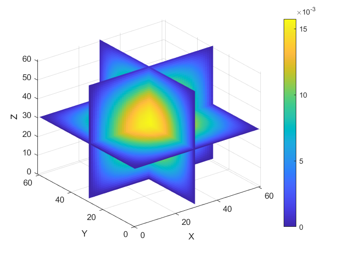

# PETSc_MsFEM

**Introduction:**

This project implements the Multiscale Finite Element Method (MsFEM) using the PETSc library. MsFEM is a numerical method for solving problems with multiscale features, such as flow and transport in heterogeneous materials.

 

**Key Features:**

*   High-performance computing using the PETSc library.
*   Implementation of the basic MsFEM algorithm.
*   Includes an example 3D head model dataset.

**File Descriptions:**

*   `main2.cpp`: Main program entry point. Sets up the problem, calls the MsFEM solver, and outputs the results.
*   `msfem.cpp`: Contains the specific implementation of the MsFEM algorithm, such as constructing basis functions, assembling the stiffness matrix, and solving the linear system.
*   `head3d.h`: Defines the mesh data for the 3D head model.

**Dependencies:**

*   PETSc (Portable, Extensible Toolkit for Scientific Computation): A library for high-performance scientific computation. Please ensure you have installed and properly configured PETSc.

**Building and Running:**

1.  **Install PETSc:** Refer to the PETSc official website ([https://petsc.org/](https://petsc.org/)) for installation instructions. Make sure the `PETSC_DIR` and `PETSC_ARCH` environment variables are set correctly.
    for example: 
    *   **Downloading PETSc:**
        *   Go to the PETSc download page: [https://petsc.org/release/download/](https://petsc.org/release/download/)
        *   Download the latest stable release (e.g., `petsc-3.20.2.tar.gz`).

    *   **Extracting PETSc:**
        *   Open a terminal and navigate to the directory where you downloaded the PETSc archive.
        *   Extract the archive:
            ```bash
            tar -xzf petsc-3.20.2.tar.gz
            ```
            This will create a directory named `petsc-3.20.2`.

    *   **Configuring PETSc:**
        *   Change directory to the PETSc source directory:
            ```bash
            cd petsc-3.20.2
            export PETSC_DIR=/path/to/your/petsc-3.20.2
            ./configure \
            --with-64-bit-indices \
            --download-mpi \
            --download-superlu_dist \
            --download-hdf5 \
            --download-parmetis \
            --download-metis \
            PETSC_ARCH=arch-real
            ```
            

            
            
3.  **Compile:** Use the PETSc compiler wrapper to compile the code. For example:

    ```bash
    make main2
    ```

    Or compile manually (replace with the correct paths):

    ```bash
    mpicxx -I${PETSC_DIR}/include -I${PETSC_DIR}/${PETSC_ARCH}/include main2.cpp msfem.cpp -L${PETSC_DIR}/${PETSC_ARCH}/lib -lpetsc -o main2
    ```

4.  **Run:** Run the program using MPI. For example:

    ```bash
    mpirun -n 4 ./main2 -fine 256 -coarse 32
    ```

    `-n 4` indicates that 4 processes are used.

**Usage:**

1.  Download or clone this repository.
2.  Install PETSc and compile the code as described above.
3.  Run the program and modify the parameters in `main2.cpp` as needed.

**License:**

This project is licensed under the MIT License. See the `LICENSE` file for details.

**Contributions:**

Contributions are welcome! Please submit a Pull Request.

**Contact:**

If you have any questions or suggestions, please submit them via GitHub issues.

**Acknowledgments:**

Thanks to the PETSc team for providing an excellent library.
